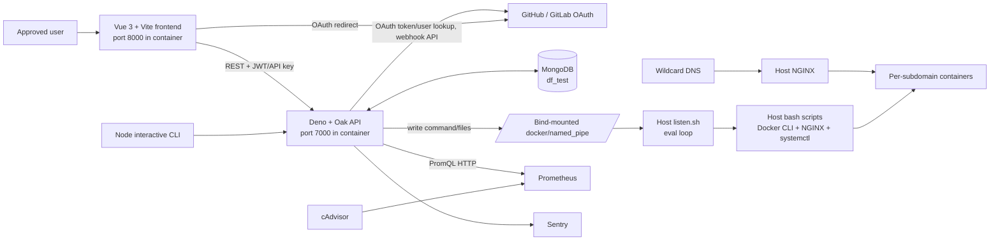

# DomainForge developer technical documentation

> Scope: this document describes the checked-out `develop` branch at commit `4c92037` ("Feat: Show Build Logs for each Deployment"). It is an implementation guide, not a proposed design. File paths and function names below refer to that branch.

## 1. Project overview

DomainForge is a self-hosted, organisation-scoped deployment and dynamic-subdomain manager. An authorised GitHub or GitLab user can register a subdomain that either redirects to a URL, proxies a host port, or deploys a GitHub repository into a Docker container. The host NGINX configuration is then generated so the subdomain reaches the selected resource. The deployment path invokes `git clone` without passing an OAuth token (`src/backend/shell_scripts/container.sh`); it does not itself enforce that the repository is public or make private-repository access work.

The main problem it addresses is giving an organisation's approved users a small deployment control plane without requiring each user to edit NGINX configuration or run Docker commands directly. It also exposes a simple web UI, an interactive Node CLI, deployment logs, and container health data.

Major capabilities confirmed by the code:

- OAuth login through GitHub and GitLab, restricted to usernames in `ADMIN_LIST` (`src/backend/auth/github.ts`, `src/backend/db.ts:checkUser`). Despite the variable name, this is an allow-list for all UI users, not only operators.
- Create, list, and delete mappings between full subdomains and `URL`, `PORT`, or `GITHUB` resources (`src/backend/main.ts`).
- Deploy a GitHub repository as static NGINX content, with its own Dockerfile, or using a generated Dockerfile for Python, NodeJS, Go, Rust, or React (`src/backend/scripts.ts:addScript`, `src/backend/utils/container.ts:dockerize`).
- Optionally register a GitHub push webhook and redeploy mappings when `main` or `master` is pushed (`src/backend/main.ts:githubWebhook`).
- Surface build/deployment logs and status files from the host bridge (`src/backend/main.ts:getLogs`, `getSubdomains`).
- Query cAdvisor metrics via Prometheus, show health/history, and restart or stop named user containers (`src/backend/health-api.ts`, `src/backend/health-monitor.ts`).

Important terms:

| Term | Meaning in this implementation |
| --- | --- |
| **content map / mapping** | A MongoDB `content_maps` document linking a `subdomain` to a resource; its TypeScript shape is `DfContentMap` in `src/backend/types/maps_interface.ts`. |
| **subdomain** | In practice, the full hostname such as `demo.example.org`, generated in `src/frontend/src/utils/create.ts:create` by appending `VITE_APP_DOMAIN`. It is also used as the Docker image/container name and NGINX config filename. |
| **resource type** | `URL` creates an HTTP 307 redirect; `PORT` creates an NGINX reverse proxy to an existing host port; `GITHUB` clones, builds, runs, and proxies a public repository. |
| **host pipe** | A bind-mounted `docker/named_pipe` directory. The backend writes a command to `pipe`; the host loop in `docker/named_pipe/listen.sh` evaluates it. It also holds generated files, `logs/`, and `status/`. |
| **static content** | A GitHub deployment selected as static (`static_content === "Yes"`); `container.sh -s` writes a basic NGINX Dockerfile. |
| **generated Dockerfile** | For a non-static GitHub project without a repository Dockerfile, DomainForge derives a Dockerfile and `.dockerignore` from stack, port, and build-command input. |

## 2. Architecture and request/data flow



### Components and communication

- **Frontend**: Vue 3 single-page application. `src/frontend/src/main.ts` mounts `App.vue`; `src/frontend/src/router/index.ts` owns routes and browser-side auth guards. It uses `fetch` directly to `VITE_APP_BACKEND` and persists token/provider/API key in `localStorage`.
- **Backend**: Deno/Oak server. `src/backend/server.ts` is the runtime entry point, builds the router, adds global error handling, CORS (`FRONTEND`), Sentry, and starts the interval monitor. `src/backend/main.ts` implements mappings/webhook/log APIs; `health-api.ts` implements health APIs.
- **MongoDB**: externally hosted or otherwise reachable via `MONGO_URI`. `src/backend/db.ts` eagerly connects at import time to database `df_test`, collections `user_auth` and `content_maps`.
- **Host execution plane**: the backend never has Docker socket access. Instead, `src/backend/scripts.ts` and `utils/auto-restart.ts` write shell command strings into `/hostpipe/pipe`. The host's `listen.sh` calls `eval "$(cat pipe)"`, which executes the supplied backend scripts with host privileges/sudo capabilities.
- **Host routing and workloads**: shell scripts create NGINX `sites-available` files, symlink them into `sites-enabled`, reload NGINX, and manage Docker containers. `container.sh` chooses the first unused TCP port in 8010–8099 and maps it to the submitted app port.
- **Monitoring**: Compose starts privileged cAdvisor and Prometheus. `utils/container-health.ts` issues PromQL requests to `PROMETHEUS_URL`; `health-monitor.ts` periodically restarts containers judged unhealthy.

### Deployment architecture

`docker/docker-compose.yml` runs four services on the deployment host: `df_backend`, `df_frontend`, `df_cadvisor`, and `df_prometheus`. The frontend/backend ports are host-published using `PORT_FRONTEND` and `PORT_BACKEND`; cAdvisor is published on 8081 and Prometheus on 9090. Host NGINX and wildcard DNS/certificates are deliberately outside Compose, as described in `docs/admin/README.md`. User application containers are also created on the host, outside the Compose project.

`docker/dev.docker-compose.yml` is byte-for-byte equivalent to `docker-compose.yml` in this branch; it is not a distinct development topology.

## 3. Repository structure and entry points

```text
.
├── README.md                         product-level introduction
├── docs/
│   ├── admin/README.md               host installation guide
│   ├── users/README.md               browser-user guide
│   ├── assets/                       screenshots used by the guides
│   └── DEVELOPER_TECHNICAL_DOCUMENTATION.md  this document
├── docker/
│   ├── docker-compose.yml            production Compose topology
│   ├── dev.docker-compose.yml        currently identical Compose topology
│   ├── Dockerfile.backend            Deno API image entry point
│   ├── Dockerfile.frontend           Vite development-server image entry point
│   ├── named_pipe/listen.sh          host command listener
│   ├── prometheus.yml                cAdvisor/Prometheus scrape configuration
│   └── .env.sample                   published-port variables
├── src/
│   ├── backend/                      Deno/Oak API, deployment, monitoring code
│   ├── frontend/                     Vue/Vite SPA
│   └── cli/                          TypeScript/Node interactive CLI package
└── .github/workflows/github-actions-ec2.yaml  master-branch SSH deployment
```

### Backend (`src/backend`)

- `server.ts` — backend entry point. Binds port **7000** (not configurable in code), registers all routes, global exception middleware, session middleware, CORS, and starts monitoring.
- `main.ts` — mapping handlers: `getSubdomains`, `addSubdomain`, `deleteSubdomain`, `getLogs`, and `githubWebhook`.
- `db.ts` — Mongo client/collection initialization and all persistence functions.
- `dependencies.ts` — central versioned Deno/NPM imports; loads `.env` from the current directory and then `src/backend/.env`.
- `scripts.ts` — maps a `DfContentMap` to host-pipe commands and generated per-subdomain files.
- `auth/github.ts` — both GitHub and GitLab OAuth code exchange, user persistence/allow-list enforcement, JWT/API-key endpoint.
- `health-api.ts`, `health-monitor.ts`, `utils/container-health.ts`, `utils/auto-restart.ts` — Prometheus query model, HTTP handlers, interval monitor, and host restart/stop commands.
- `utils/container.ts` — Dockerfile/.dockerignore generator for supported stacks.
- `utils/crypto.ts` — AES-GCM encryption/decryption of stored `env_content`.
- `utils/jwt.ts`, `utils/apiKeyGen.ts`, `utils/get-user.ts` — ephemeral JWT signer/verifier, CLI key format, and provider user API lookup.
- `shell_scripts/` — host-executed scripts: `automate.sh` for URL/port mappings, `container.sh` for GitHub deploys, `delete.sh`, `restart.sh`, `stop.sh`; `redeploy.sh` is only a delete wrapper and is not called by TypeScript.
- `tests/container-health.test.ts` — the sole test file; largely self-contained assertions plus `auto-restart.ts` command assertions.

`server.ts` installs `Session.initMiddleware()` from `oak_sessions`, but no committed handler reads or writes an Oak session. Authentication state in the application flow is instead supplied by token fields/query parameters and browser `localStorage`.

### Frontend (`src/frontend`)

- `src/main.ts` and `App.vue` — SPA bootstrap and `<router-view>`.
- `src/router/index.ts` — `/`, `/health`, `/login`, catch-all routes; protects home/health using `check_jwt`.
- `src/components/Home.vue` — mapping table, create/delete/log/API-key UI.
- `components/modal.vue` — create-mapping form; controls which GitHub deployment fields are submitted.
- `components/Login.vue` and `loginmodal.vue` — OAuth callback handling and provider selection.
- `components/ContainerHealth.vue` — health cards, Chart.js-on-CDN history charts, restart/stop interactions.
- `components/LogsModal.vue` — reads and refreshes deployment logs every three seconds by default.
- `utils/` — direct browser API client functions and OAuth URL generation.
- `deno.json` — Vite tasks; `vite.config.mts` enables Vue only (no dev API proxy).

### CLI (`src/cli`)

- `index.ts` is the `domainforge` executable entry (`package.json:bin`) and drives the interactive menu.
- `features/authUser.ts`, `createDomain.ts`, `listDomain.ts`, and `deleteDomain.ts` call the same backend endpoints with Axios.
- `utils/promptTaker.ts` blocks a set of shell-like input characters before prompting continues.
- `package-lock.json` is the only committed dependency lockfile. Deno code uses URL/NPM imports, and `.gitignore` excludes `deno.lock`; intent is not stated in code.
- `src/backend/deno.json` defines `deno task start` and `deno task test`. Its `start` task grants only network/read/environment permissions, while deployment paths require run/write permissions; use the explicit full-permission command below for host-pipe deployment testing.
- `src/frontend/src/style.css`, `src/frontend/src/vite-env.d.ts`, `src/frontend/public/`, and `src/frontend/index.html` provide global styling, Vite/Vue type declarations, image assets, and the SPA HTML mount point. `components/404.vue` is the catch-all route view.
- Root `.gitignore`, `docker/.dockerignore`, and `LICENSE.md` respectively control ignored runtime/dependency artifacts, Docker build context exclusions, and the AGPL v3 project license.

## 4. Core end-to-end flows

### Login and authorisation

1. `loginmodal.vue:loginWith` stores provider in `localStorage` and navigates the browser to the provider URL produced by `utils/oauth-urls.ts:oauthUrl`.
2. The provider redirects to `/login?code=...`. `Login.vue` reads the `code` and calls `utils/authorize.ts:authorize`.
3. `POST /auth/github` or `POST /auth/gitlab` reaches `auth/github.ts:authenticateAndCreateJWT`. It exchanges the code for an access token, calls `db.ts:checkUser`, then returns a JWT if the fetched provider username is in `ADMIN_LIST`.
4. `checkUser` upserts `{ githubId|gitlabId, authToken }` to `user_auth`; GitHub's token is later used to create repository webhooks.
5. `utils/jwt.ts:createJWT` signs a provider-ID claim with an in-memory HMAC key. The client stores the token as `JWTUser`; a backend restart invalidates prior JWTs. This does not cryptographically invalidate the separately generated three-part API-key format, because `utils/jwt.ts:decodeApiKey` only base64-decodes it when called with provider `CLI`.

### Create a URL/port/GitHub mapping

```mermaid
sequenceDiagram
  participant UI as modal.vue / CLI
  participant API as POST /map
  participant DB as Mongo content_maps
  participant Pipe as /hostpipe/pipe
  participant Host as listen.sh + shell scripts
  participant N as Host NGINX
  UI->>API: mapping + author + token + provider
  API->>API: checkJWT; validate subdomain; encrypt env_content
  API->>DB: addMaps (status=PENDING if unique)
  API->>Pipe: command and, for generated builds, files
  Pipe->>Host: execute command
  Host->>N: write/symlink configuration; reload
  Host-->>Pipe: status/<subdomain>.status and logs/<subdomain>.log
  API-->>UI: {status: "success"} after command was queued
```

The browser form in `components/modal.vue` calls `utils/create.ts:create`. It appends `VITE_APP_DOMAIN` to the entered label, then posts its full mapping document to `POST /map`. `main.ts:addSubdomain` validates the full subdomain with `isValidSubdomain`, strips credential fields, encrypts `env_content`, inserts the mapping, optionally registers a GitHub webhook, and awaits `scripts.ts:addScript`.

`addScript` behaves as follows:

- **URL**: queues `automate.sh -u <resource> <subdomain>`. That script emits a `return 307 <resource>` NGINX virtual host.
- **PORT**: queues `automate.sh -p <resource> <subdomain>`. The resource is treated as a local port and NGINX proxies to `localhost:<resource>`.
- **GITHUB + static**: writes `/hostpipe/.env.<subdomain>` if supplied and queues `container.sh -s`. The script clones the repository, produces a basic `nginx:alpine` Dockerfile, builds/runs it, creates an NGINX proxy virtual host, and removes clone/temp files.
- **GITHUB + non-static + no Dockerfile**: generates `Dockerfile.<subdomain>` using `dockerize`, a per-domain `.dockerignore`, optional `.env`, and queues `container.sh -g`.
- **GITHUB + non-static + Dockerfile**: queues `container.sh -d`; the script leaves the repository Dockerfile intact. Unlike the static and generated-Dockerfile branches, `scripts.ts:addScript` does not write submitted `env_content` to `/hostpipe/.env.<subdomain>` in this branch, so that field is stored but not supplied to the container build/deploy path.

The backend responds after its pipe write succeeds; it does **not** wait for the host listener, clone, Docker build, or NGINX reload. The frontend reloads afterwards. `getSubdomains` replaces each mapping's stored `status` with `status/<subdomain>.status` when present; the scripts write `DEPLOYING`, `READY`, or `FAILED`.

### GitHub webhook redeploy

When `enable_ci === true`, a GitHub mapping owned via GitHub causes `addSubdomain` to asynchronously fetch repository hooks and create a `push` hook to `${BACKEND_URL}/webhook/github` (or `http://localhost:7000/webhook/github` if unset). `githubWebhook` accepts only `push` events to `main` or `master`, normalizes clone/HTML repo URLs through `db.ts:getDeploymentsByRepo`, then for every matching enabled mapping calls `deleteScript`, decrypts stored environment text, and calls `addScript` again.

There is no webhook signature validation in this branch; see Security and limitations.

### List, logs, and deletion

- `Home.vue:setup` obtains the identity through `/auth/jwt`, then calls `utils/maps.ts:getMaps` → `GET /map`. Administrators listed in `ADMIN_LIST` receive all mappings; other allow-listed users receive only documents with matching `author` (`db.ts:getMaps`).
- `LogsModal.vue` calls `GET /map/:subdomain/logs`; `main.ts:getLogs` verifies the token, checks whether the requested subdomain occurs in that caller's `getMaps` result, validates the hostname, and reads at most 100 KiB from `/hostpipe/logs/<subdomain>.log`. Since `getMaps` returns all mappings to an `ADMIN_LIST` user, such a user can read every mapping's logs.
- `deletemodal.vue` calls `POST /mapdel`. `deleteSubdomain` verifies the token, calls `db.ts:deleteMaps`, queues `delete.sh` only if Mongo reports deletion, and attempts to remove status/log files. `delete.sh` removes NGINX files, stops/removes the Docker container/image, and reloads NGINX.

### Health monitoring and operator actions

`server.ts` starts `startHealthMonitor()` once per backend process. `health-monitor.ts:checkContainerHealth` queries cAdvisor metrics through Prometheus via `getAllContainerStats`, ignores the four DomainForge service containers and `k8s_*`, and considers a user container unhealthy when CPU, memory, restart count, or status exceeds conditions in `utils/container-health.ts:isUnhealthy`. It restarts unhealthy containers through `restart.sh` with exponential cooldown (30 seconds, doubled up to 10 minutes) until `MAX_RESTART_COUNT` attempts.

The `/health` page obtains summary and metrics REST endpoints. Restart/stop actions queue host commands. Counts shown to clients are in-memory counters from `utils/auto-restart.ts`; they reset when the backend restarts and are not Docker restart counters.

## 5. Backend/core logic and API reference

All routes originate in `src/backend/server.ts`. The global Oak error middleware returns `{ "error": err.message }`, preserves Oak HTTP errors, otherwise returns 500, and sends exceptions to Sentry. CORS allows exactly the configured `FRONTEND` origin. Bodies are usually parsed from raw request body values rather than using content-type-specific DTO validation.

All endpoint auth ultimately compares the supplied `author`/`user` with `checkJWT(provider, token)`. For browser OAuth tokens this verifies the volatile HMAC JWT. For `provider === "CLI"`, it merely base64-decodes the middle portion of a three-part API key in `utils/jwt.ts:decodeApiKey`.

| Method and route | Purpose, request, response | Auth / implementation |
| --- | --- | --- |
| `POST /auth/github` | Body is raw OAuth `code`. Exchanges it with GitHub and returns a JWT string, or text `not authorized`. | No prior auth. `auth/github.ts:githubAuth`. |
| `POST /auth/gitlab` | Same, with GitLab's token endpoint and `${FRONTEND}/login` redirect URI. | No prior auth. `gitlabAuth`. |
| `POST /auth/jwt` | JSON/raw object `{ jwt_token, provider }`; responds `{ user, apiKey }`. | Validates JWT, then always generates an API-key-shaped string for returned user. `handleJwtAuthentication`. |
| `GET /map?user=&token=&provider=` | Returns an array of mapping documents. It decrypts each `env_content` before sending and overlays host-file status if available. | User must match token. Admin gets every mapping. `main.ts:getSubdomains`. |
| `POST /map` | Mapping JSON: required practical fields are `subdomain`, `resource_type`, `resource`, `author`, `token`, `provider`; GitHub deploys also use `env_content`, `static_content`, `dockerfile_present`, `stack`, `port`, `build_cmds`, `enable_ci`. Responds `{status:"success"}` or `{status:"failed"}`. | Auth plus hostname validation. Inserts document then queues deployment. `main.ts:addSubdomain`. |
| `POST /mapdel` | JSON generally `{ subdomain, author, token, provider }`; passes remaining fields to Mongo deletion. Returns Mongo `DeleteResult`. | Auth. `main.ts:deleteSubdomain`, `db.ts:deleteMaps`. |
| `GET /map/:subdomain/logs?user=&token=&provider=` | Returns `{logs}` containing last 100 KiB, or an error/no-log string. | Auth, mapping ownership, and hostname validation. `main.ts:getLogs`. |
| `POST /webhook/github` | GitHub push payload. Ignores non-push or refs other than main/master; returns text `success`/`ignored`. | **No authentication or signature verification.** `main.ts:githubWebhook`. |
| `GET /health?user=&token=&provider=` | Returns aggregate counts and container summaries, including transient restart/stop counts. | Auth only; returns all detected user containers. `health-api.ts:getContainerHealth`. |
| `GET /health/summary?user=&token=&provider=` | Returns overview, monitor configuration/state, and unhealthy-container reasons. The committed Vue UI does not call this route. | Auth only. `getHealthDashboard` in `src/backend/health-api.ts`. |
| `GET /health/:subdomain/metrics?step=&user=&token=&provider=` | `step` allowed presets: `1s`, `15s`, `1m`, `5m`, `1h`, `1d`; returns CPU/memory series from Prometheus. | Auth only; does not check ownership or container-name format. `getContainerMetrics`. |
| `POST /health/:subdomain/restart` | JSON `{author, token, provider}`; response success/error object. | Auth and `validateContainerName`; no ownership/admin test. `restartContainerHandler`. |
| `POST /health/:subdomain/stop` | Same request/response form as restart. | Same. `stopContainerHandler`. |
| `POST /health/check` | JSON `{author, token, provider}`; triggers an immediate monitor pass and returns success. | Auth plus username must appear in `ADMIN_LIST`. `triggerHealthCheckHandler`. |

## 6. Frontend/interface

The frontend has no state-management package, generated API client, or server-side rendering. Component-local data, `localStorage`, and direct `fetch` calls are the state/data model.

- `router/index.ts:authGuard` gates `/` and `/health`, but server endpoints remain the true enforcement point.
- `Home.vue` uses async `setup` (inside `App.vue`'s `<Suspense>`) to resolve identity, generated CLI key, and mappings. It displays only date, subdomain, status, resource, and type; decrypted environment text is fetched but not displayed.
- `modal.vue` collects the deployment decision tree. Browser validation uses the same hostname regex as the backend. `utils/create.ts:secure_input` adds a client-side blacklist before submission.
- `Login.vue` uses the provider stored before OAuth; `authorize.ts` writes JWT after receiving a successful raw-text response.
- `ContainerHealth.vue` dynamically imports Chart.js from jsDelivr the first time a metric dialog opens. This is a runtime external dependency not present in `deno.json`.
- `ApiKeyModal.vue` simply displays the API-key string stored by `/auth/jwt`; it uses the legacy `document.execCommand("copy")` API.

## 7. Infrastructure, configuration, and deployment

### Docker and host prerequisites

`docker/Dockerfile.backend` copies the full repository, caches `dependencies.ts`, then declares `CMD ["run", "--allow-net", "--allow-env", "--allow-read", "--allow-run", "--allow-sys", "--allow-write", "src/backend/server.ts"]`. It relies on the `denoland/deno:latest` image's command/entrypoint behavior to run Deno. `Dockerfile.frontend` declares `CMD ["deno", "task", "dev", "--port", "8000", "--host"]` and does not build static frontend assets for production. Because both files rely on an unpinned external base image and use different command forms, verify their effective entrypoint behavior against the pulled image before production deployment; no image digest or entrypoint override is committed here.

The host must supply Docker, NGINX, systemd, `sudo` permissions for the listener user, a working `ss` command, Git access appropriate for cloned repositories, DNS wildcard records, and TLS termination/certificates. Compose's backend bind-mount is configured with source `../docker/named_pipe`; the expected runtime working directory is `docker/`.

No initial NGINX configuration for the DomainForge frontend/API is committed. `automate.sh` and `container.sh` generate only per-subdomain HTTP virtual hosts, while `docs/admin/README.md` only directs the operator to install/configure NGINX. An operator must therefore supply the site/reverse-proxy configuration that exposes the published frontend/backend ports, HTTP-to-HTTPS policy, and wildcard TLS certificates; its exact form cannot be derived from this repository.

### Environment variables

Do not commit `.env` files. The table records code use; the samples/docs are not fully synchronized.

| Variable | Consumer and purpose | Source/status |
| --- | --- | --- |
| `PORT_BACKEND`, `PORT_FRONTEND` | Publish Compose backend 7000/frontend 8000 ports. | `docker/.env.sample`, Compose. |
| `GITHUB_OAUTH_CLIENT_ID`, `GITHUB_OAUTH_CLIENT_SECRET` | GitHub OAuth code exchange. | backend sample and `server.ts`. |
| `GITLAB_OAUTH_CLIENT_ID`, `GITLAB_OAUTH_CLIENT_SECRET` | GitLab OAuth code exchange. | backend sample and `server.ts`. |
| `FRONTEND` | Oak CORS origin and GitLab callback base. | backend sample and `server.ts`. |
| `MONGO_URI` | Mongo driver connection string. | **Required by `db.ts`, but absent from `src/backend/.env.sample`; legacy docs mention unused `MONGO_API_KEY`/`MONGO_APP_ID`.** |
| `ADMIN_LIST` | Pipe-separated provider usernames eligible to log in; controls global mapping read for those names and manual health checks. | backend sample. |
| `SENTRY_DSN` | Sentry initialization. | backend sample and `server.ts`. |
| `ENCRYPTION_KEY` | AES-GCM key material for mapping environment content. | backend sample and `utils/crypto.ts`. |
| `MEMORY_LIMIT` | Docker `--memory` limit for generated user containers; falls back to `512m` in code. | backend sample. |
| `BACKEND_URL` | Public base URL when auto-creating GitHub webhooks. | used in `main.ts`, **not present in sample**. |
| `PROMETHEUS_URL` | API base for health queries; defaults to `http://prometheus:9090`. | backend sample. |
| `HEALTH_CHECK_INTERVAL`, `HEALTH_DEBUG`, `MAX_CPU_THRESHOLD`, `MAX_MEMORY_THRESHOLD`, `MAX_RESTART_COUNT` | Monitoring interval/debug/thresholds. | backend sample. |
| `VITE_APP_BACKEND`, `VITE_APP_DOMAIN` | Browser API base and host suffix appended to subdomain labels. | frontend sample and frontend utilities. |
| `VITE_APP_GITHUB_OAUTH_CLIENT_ID`, `VITE_APP_GITHUB_OAUTH_REDIRECT_URL`, `VITE_APP_GITLAB_OAUTH_CLIENT_ID`, `VITE_APP_GITLAB_OAUTH_REDIRECT_URL` | Browser-visible OAuth client IDs and redirect URLs read by `src/frontend/src/utils/oauth-urls.ts`. The frontend sample additionally lists `VITE_APP_*_OAUTH_CLIENT_SECRET`, but no committed frontend source reads those values; they must not be treated as confidential because Vite exposes `VITE_*` variables to browser code. | frontend sample and `oauth-urls.ts`. |

### CI/CD and branch reality

`.github/workflows/github-actions-ec2.yaml` runs only when **`master`** is pushed. It SSHes to an EC2 host, changes to `~/domain-forge/docker`, runs `docker compose down`, `git pull origin master`, and `docker compose up -d --build`. Thus the workflow does not deploy `develop`, and it has no test/lint/build verification job. The current requested branch is `develop`; the workflow represents master deployment only.

## 8. Data model and storage

MongoDB is the durable application store. The code does not define indexes, migrations, ODM schemas, or validation beyond the TypeScript interface. `db.ts:addMaps` performs a read-before-insert uniqueness check on `subdomain`; a Mongo unique index is not created in code.

| Collection/entity | Fields and lifecycle |
| --- | --- |
| `user_auth` | Provider-specific username field (`githubId` or `gitlabId`) and `authToken`. `checkUser` upserts it only after the user is found in `ADMIN_LIST`. `getUserToken` reads it to register GitHub hooks. |
| `content_maps` / `DfContentMap` | `subdomain`, `resource_type`, `resource`, `author`, `date`, optional deployment fields (`enable_ci`, encrypted `env_content`, `static_content`, `dockerfile_present`, `stack`, `port`, `build_cmds`) and `status`. `addMaps` sets status `PENDING`; host status files become the UI's effective status. |
| Host ephemeral files | `docker/named_pipe/status/<subdomain>.status`, `logs/<subdomain>.log`, temporary `.env.<subdomain>`, `Dockerfile.<subdomain>`, and `.dockerignore.<subdomain>`. `container.sh` removes temporary deployment files after build. |
| Docker/NGINX resources | Docker image and container named exactly as `subdomain`; NGINX config `/etc/nginx/sites-available/<subdomain>.conf` plus enabled symlink. These are host state, not database records. |
| Prometheus volume | Named Compose volume `prometheus_data`, retained with 24-hour/256MB retention limits. |

`env_content` enters through the UI/CLI, is AES-GCM encrypted by `encryptEnv` before Mongo insertion, decrypted to be returned by `GET /map`, and decrypted again before webhook redeploy. It is plaintext in the browser response and temporary host `.env` file during deploy.

## 9. Developer setup and verification

The following is the exact code-aligned setup. Running deploys locally requires a Linux-like host because the implementation invokes host NGINX, Docker, systemd, sudo, and named pipes.

1. Check out the intended branch and create environment files without committing them:

   ```bash
   git switch develop
   cp docker/.env.sample docker/.env
   cp src/backend/.env.sample src/backend/.env
   cp src/frontend/.env.sample src/frontend/.env
   ```

2. Fill the Docker port values. In the backend file, set every needed OAuth/Sentry/allow-list/encryption/monitor value **and add `MONGO_URI`**, because it is the variable actually read by `src/backend/db.ts`. Set `FRONTEND` to the browser origin and `BACKEND_URL` to the externally reachable API base if testing auto-webhooks. In the frontend file set `VITE_APP_BACKEND` to the full backend base URL (for example `http://localhost:<published-backend-port>`) and `VITE_APP_DOMAIN` to a domain suffix you control. Register OAuth redirect URLs ending in `/login`.

3. For a full host deployment, ensure Docker, NGINX, systemd/sudo permissions, DNS/TLS, and the named pipe bridge exist:

   ```bash
   mkfifo docker/named_pipe/pipe
   cd docker/named_pipe
   chmod +x listen.sh
   ./listen.sh
   ```

   Keep the listener running under an appropriately restricted service account. It must run in a directory where `../../src/backend/shell_scripts/...` resolves as expected; the administrator guide uses `docker/named_pipe`.

4. In another terminal, start Compose from `docker/`:

   ```bash
   cd docker
   docker compose up --build -d
   docker compose ps
   docker compose logs -f deno vue prometheus cadvisor
   ```

5. For frontend-only work, use Deno from `src/frontend`:

   ```bash
   deno task dev --port 8000 --host 127.0.0.1
   deno task build
   ```

   `src/backend/deno.json` also provides `deno task start` and `deno task test` when invoked from `src/backend`, but `start` does not grant the `--allow-run` and `--allow-write` permissions needed by `scripts.ts:addScript`, `deleteScript`, or host status/log access. For backend work that exercises those paths, run from repository root so `dependencies.ts` can load `src/backend/.env`:

   ```bash
   deno run --allow-net --allow-env --allow-read --allow-run --allow-sys --allow-write src/backend/server.ts
   ```

6. For CLI work, install/build in `src/cli`:

   ```bash
   npm ci
   npm run build
   node dist/index.js --backend http://localhost:7000 --token YOUR_API_KEY
   ```

7. The only test command present is:

   ```bash
   deno test --allow-net --allow-env --allow-read --allow-run --allow-sys --allow-write src/backend/tests/container-health.test.ts
   ```

   The backend also defines `deno task test` in `src/backend/deno.json`, which expands to `deno test --allow-env --allow-net ./tests/`; its current tests use the injected executor in `utils/auto-restart.ts` rather than invoking host commands. This environment could not execute either form because `deno` is not installed (`/bin/bash: deno: command not found`). The repository provides no frontend test suite, CLI test suite, lint command, formatter command, or root package manifest.

Common debugging locations:

- API startup/database failure: backend container logs, then confirm `MONGO_URI` and reachability; `db.ts` prints connection diagnostics.
- CORS/OAuth failure: compare `FRONTEND`, `VITE_APP_BACKEND`, provider redirect URL, and the provider captured in localStorage; follow `authorize.ts` and `auth/github.ts`.
- A mapping stays `PENDING`/`DEPLOYING`: inspect `docker/named_pipe/logs/<subdomain>.log`, `status/<subdomain>.status`, listener output, then host NGINX/Docker state.
- No health data: inspect `df_cadvisor` and `df_prometheus`, `docker/prometheus.yml`, and test the configured `PROMETHEUS_URL` from the backend container.

## 10. Development workflow

Confirmed repository conventions are limited: `README.md` asks contributors to use Conventional Commits and open an issue before significant changes. The working branch here is `develop`, while the only deployment workflow follows `master`; no branch protection, pull-request workflow, linting, or formatting configuration is committed.

Recommended code-aligned workflow:

1. Branch from/target the branch agreed by maintainers; do not assume pushing `develop` deploys because CI listens only to `master`.
2. Keep changes scoped by surface: frontend components/utilities, backend handlers/services, host scripts, and Compose/docs are separate responsibilities.
3. Run the Deno test command and relevant `deno task build` / `npm run build` checks where tooling exists. Test host actions in a non-production host because they mutate Docker and `/etc/nginx`.
4. Use Conventional Commit messages as requested in `README.md`, open a PR, and explicitly review security effects of any host-pipe, shell, OAuth, or environment-variable change.

## 11. Important technical decisions

### Confirmed from code

- **Deno/Oak backend and Vue/Vite SPA**: imports and entry points are defined in `dependencies.ts`, `backend/deno.json`, `frontend/deno.json`, and `vite.config.mts`. Most Deno dependency versions are explicit, but the Sentry URL path and Docker base-image tag are unpinned.
- **External MongoDB rather than a Compose database**: Compose has no Mongo service; `db.ts` only consumes `MONGO_URI` and uses database `df_test`.
- **Host-command bridge rather than Docker socket mount**: the Compose backend mounts only `named_pipe`; its Deno process writes shell strings, and `listen.sh` evaluates them on the host.
- **NGINX remains host-managed**: all generated virtual-host files target `/etc/nginx`, not a proxy container.
- **Container monitoring is metrics-based**: cAdvisor metrics are scraped by Prometheus and queried over HTTP; no Docker Engine health API is used by the backend.
- **Deployment config persists with the mapping**: `DfContentMap` contains stack/port/build/env/CI fields so webhook redeploy can reconstruct deployment work.

### Inferred from implementation (not guaranteed product policy)

- The system appears intended for a trusted single organisation/server: it assumes host infrastructure can grant the listener powerful Docker/NGINX privileges. Repository accessibility is not enforced by the code; `container.sh` invokes `git clone` without a token.
- `ADMIN_LIST` appears to serve as both login allow-list and administrator flag. This follows its use in `checkUser`, global mapping visibility, and manual health check, but no explicit role model exists.
- The container name/subdomain one-to-one mapping implies one deployment per full hostname and no rolling/blue-green deployment layer.

## 12. Security posture and sensitive configuration

Never print or commit values for OAuth client secrets, Mongo connection credentials, Sentry DSN, encryption key, SSH key, or GitHub workflow secrets. `.gitignore` excludes `.env`, and GitHub workflow credentials are referenced as Actions secrets.

Controls present in code:

- `isValidSubdomain` permits only alphanumeric hostname labels, dots, and hyphens; `scripts.ts:shellEscape` applies a further character allow-list to selected shell arguments.
- Mapping and health APIs generally compare declared user to a checked token; log reads additionally check ownership.
- Environment content is encrypted at rest using AES-GCM (`utils/crypto.ts`), provided an adequate `ENCRYPTION_KEY` is configured.
- `restart.sh`/`stop.sh` and `validateContainerName` validate the host container identifier.
- CORS is restricted to one configured frontend origin.

Material exposure and limitations visible in code:

- `listen.sh` evaluates pipe content, and host scripts run privileged Docker/NGINX commands. This is an intentionally high-trust execution boundary; backend compromise can become host compromise.
- `POST /webhook/github` does not verify a GitHub signature, even though it can delete/redeploy matching mappings.
- JWT signing key is generated in memory on process start, so JWTs do not survive restarts. The CLI API key is not signed or expiry-checked in the `provider === "CLI"` branch: `utils/jwt.ts:decodeApiKey` returns its base64 payload when there are three dot-separated segments. The shipped CLI instead sends provider `github` in `src/cli/index.ts`, creating an implementation mismatch.
- GitHub OAuth requests `admin:repo_hook` from the browser (`oauth-urls.ts`) so the backend can create hooks using stored access tokens. The frontend sample also exposes fields named OAuth “secret”; Vite environment values are bundled to clients, so confidential client secrets must not be treated as confidential there.
- `GET /map` deliberately decrypts and returns `env_content` to authenticated clients. Temporary plaintext `.env.<subdomain>` is host-accessible during deployment.
- Compose publishes cAdvisor (8081) and Prometheus (9090) to all host interfaces by default; secure them at network/firewall/reverse-proxy level.

## 13. Known limitations and technical debt

These are observed implementation issues, not speculative requirements.

- **Configuration drift**: `docs/admin/README.md` and `src/backend/.env.sample` list legacy `MONGO_API_KEY`/`MONGO_APP_ID`, but no backend code reads them; `db.ts` requires `MONGO_URI`. Admin docs use `VITE_APP_BACKEND_PORT`, while frontend code uses `VITE_APP_BACKEND`. `main.ts:addSubdomain` uses `BACKEND_URL`, but it is not sampled.
- **No webhook authenticity check**: `main.ts:githubWebhook` reads raw bytes but does not inspect `x-hub-signature-256` or a configured secret. Any caller able to reach it can submit matching push-shaped payloads.
- **CLI protocol defects**: `index.ts` sets `provider = 'github'`, while `utils/jwt.ts:checkJWT` recognizes API keys only for `provider === 'CLI'`; `authUser.ts` returns the entire `{user, apiKey}` object but `index.ts` compares that value with the string `'not verified'` and passes it as `author`; `createDomain.ts` tests `resourceType === 'GitHub'` although choices use `GITHUB`; it hard-codes `domains.pluto.mdgspace.org` and offers only Python/NodeJS in a helper despite frontend support for five stacks. `deleteDomain.ts` also calls `listDomains` with its first two arguments reversed.
- **Deletion filter fragility**: `db.ts:deleteMaps` calls `deleteOne` with every submitted remaining field, not just the unique subdomain/author. The comment notes this risk. UI requests happen to submit a minimal filter; extra CLI/API fields can prevent deletion.
- **Unrecognised resource types can be stored as successful mappings**: `main.ts:addSubdomain` validates the subdomain but does not restrict `resource_type`. `db.ts:addMaps` inserts an unknown type, then `scripts.ts:addScript` has no matching branch but returns; the handler still reports `{status:"success"}`.
- **Status/db mismatch**: Mongo's `status` is set only to `PENDING` and is not updated on deploy success/failure. The UI derives current status from host files when available; those files are non-durable host state.
- **Deployment completion is asynchronous and unacknowledged**: `addSubdomain` returns success after queuing the listener command, before build result; pipe writes and the listener loop have no durable queue, acknowledgement, locking, or retry mechanism (`scripts.ts`, `listen.sh`).
- **Command/resource validation is restrictive but uneven**: `scripts.ts:shellEscape` permits a narrow character set that excludes many valid Git URLs (notably `@` and `+`) and valid build commands are embedded in generated Dockerfiles without validation. `container.sh` later uses several variables unquoted (`git clone $resource`, Docker commands).
- **Port allocation race and finite range**: `container.sh` scans 8010–8099 with `ss`, chooses `available_ports[0]`, and has no lock or explicit exhausted-range check. Concurrent builds can choose the same port.
- **Health status is incomplete**: `utils/container-health.ts:determineStatus` returns only `running` or `unknown`; it never creates `exited`, `paused`, or `unhealthy` despite the type and UI supporting them. `restartCount` in Prometheus-derived stats is always defaulted to zero; displayed counts are local process memory only.
- **Health authorization is broad**: health list/metrics/restart/stop routes verify identity but do not restrict targets to the caller's mappings or admins (`health-api.ts`). Any allow-listed authenticated user can address a valid named user container.
- **Metrics query input is not validated/escaped**: `health-api.ts:getContainerMetrics` passes `ctx.params.subdomain` directly to `utils/container-health.ts:getContainerHistory`, which interpolates it into PromQL label matchers. The restart/stop handlers validate the name, but the metrics handler does not.
- **Production image runs development frontend**: `Dockerfile.frontend` starts Vite dev server, not an immutable compiled static bundle. `dev.docker-compose.yml` does not differ from production Compose.
- **Dependency reproducibility/security**: backend Dockerfile is `denoland/deno:latest`; Deno URLs include a mix of pinned versions and Sentry's unpinned module path; no Deno lockfile is committed. cAdvisor/Prometheus are version-pinned in Compose.
- **Tests are narrow**: the only test file has 837 lines, many reimplement small functions locally rather than importing production functions. There are no route/database/webhook/deployment/frontend integration tests.
- **Operational log artifact in source tree**: `docker/named_pipe/nohup.out` is a tracked historical log containing deployment errors, rather than generated/ignored runtime output.

## 14. New developer mental model: where to change X

| If you need to change… | Start here, then follow |
| --- | --- |
| Domain creation validation/payload/UI | `src/frontend/src/components/modal.vue`, `utils/create.ts`, then `src/backend/main.ts:addSubdomain` and `types/maps_interface.ts`. |
| URL/port routing | `src/backend/scripts.ts:addScript` → `src/backend/shell_scripts/automate.sh`; host NGINX behavior is generated there. |
| GitHub build/deploy behavior | `scripts.ts:addScript` → `shell_scripts/container.sh`; change generated-stack templates in `utils/container.ts:dockerize`. |
| Deployment status/logs | `container.sh`/`automate.sh` status/log writes, then `main.ts:getSubdomains` and `getLogs`, plus `LogsModal.vue`. |
| GitHub webhook/auto-deploy | `main.ts:addSubdomain` hook registration, `main.ts:githubWebhook`, and `db.ts:getDeploymentsByRepo`. |
| OAuth/authentication/API keys | `frontend/src/utils/oauth-urls.ts`, `authorize.ts`, `backend/auth/github.ts`, `utils/jwt.ts`, `utils/apiKeyGen.ts`, `db.ts:checkUser`. |
| Mapping persistence/schema | `backend/types/maps_interface.ts` and `backend/db.ts`; account for existing Mongo documents because no migrations exist. |
| REST routes/error/CORS | `backend/server.ts` route table/global middleware; handler modules `main.ts` and `health-api.ts`. |
| Container health thresholds/metrics/restarts | `utils/container-health.ts`, `health-monitor.ts`, `health-api.ts`, and `utils/auto-restart.ts`; scrape inputs are in `docker/prometheus.yml`. |
| Docker services/ports/images | `docker/docker-compose.yml`, both Dockerfiles, `docker/.env.sample`; note host NGINX is outside Compose. |
| Host bridge/permissions | `docker/named_pipe/listen.sh` and all `backend/shell_scripts/*.sh`; treat changes here as host-security changes. |
| CI deployment branch/commands | `.github/workflows/github-actions-ec2.yaml`; it currently targets master only. |
| CLI behavior | `src/cli/index.ts`, then relevant `features/` module and `package.json`. |
