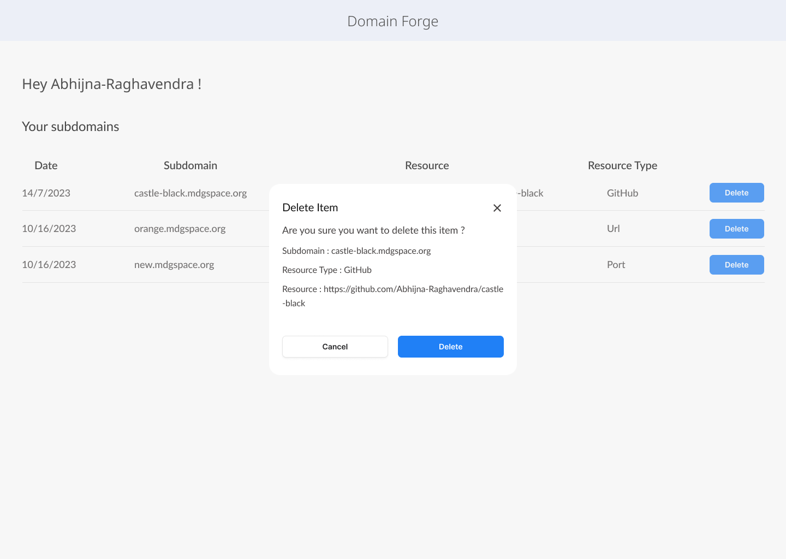

# Usage

### Login


Authenticate using your *GitHub* or *GitLab* credentials to access the index page.


### Adding subdomains

You can click on the **+ Add** button to add subdomains. Your resource can be of three types:
- **URL**: Enter the URL pointing to your resource.
- **PORT**: If your resource is actively hosted on your server, indicate the specific PORT it is running on
- **GITHUB**: Provide a link to your public github repository here.
    * If your repository has any environment variables in the root directory, specify their values in the given text box in the following format:
    ```
    key1=value1
    key2=value2
    ```
    * If your repository does not have static content, specify the *techstack* used and the *port* your application would be running on. You also have to specify the *BUILD* and *RUN* commands in the text box mentioned.
    > For example, if you have a Django application you will have the following *BUILD* and *RUN* commands:   
    > ```sh
    > python manage.py makemigrations
    > python manage.py migrate
    > python manage.py runserver 0.0.0.0:8000 
    > ```


### Deleting subdomains

Click on the **Delete** button to remove any existing subdomains.
